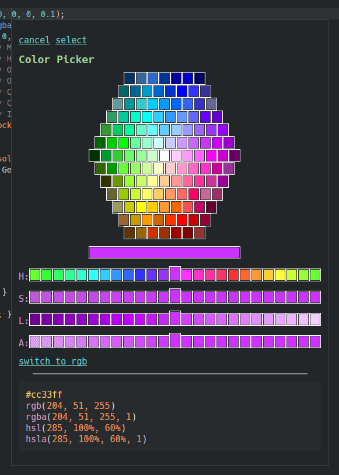
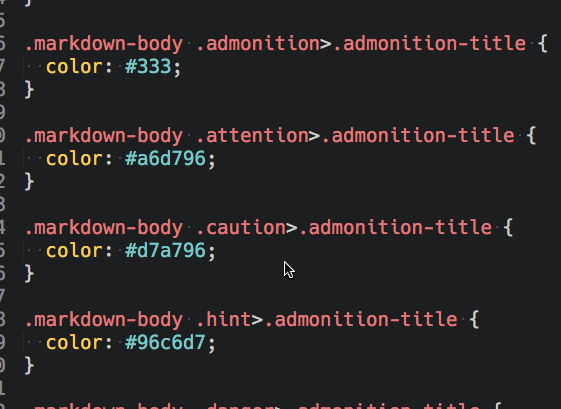

[![Unix Build Status][travis-image]][travis-link]
[![Package Control Downloads][pc-image]][pc-link]
![License][license-image]
# ColorHelper
ColorHelper makes work with colors easier by providing inline color previews in your documents (ST3 build 3118+) and offers tooltips with color previews of stylesheet colors, provides color translation, and allows the storing and accessing of favorite colors in color palettes.  Most features are optionally configurable. For the most part, these tooltips should show any time the cursor is in a CSS, SCSS, or SASS color.  It should also appear when in HTML style attributes.

# Features
- Inline color previews.
- Useful tooltip popups that show the previews of selected colors.
- Support colors in CSS, SCSS, SASS, and HTML attributes.
- Show all the colors in a file in a special color palette in the tooltip.
- Allow saving, accessing, and managing colors in named color palettes all from the tooltip.
- Select and insert colors from the color palettes via the tooltip.
- Translate an existing color form to a new form the tooltip.  Supports rgb, rgba, hex, hexa, hsl, hsla, gray, hwb, and colors names.
- Can optionally treat hexa format (#RRGGBBAA) as #AARRGGBB.

# Documentation
http://facelessuser.github.io/ColorHelper/

# License
ColorHelper is released under the MIT license.

Copyright (c) 2015 - 2016 Isaac Muse <isaacmuse@gmail.com>

Permission is hereby granted, free of charge, to any person obtaining a copy of this software and associated documentation files (the "Software"), to deal in the Software without restriction, including without limitation the rights to use, copy, modify, merge, publish, distribute, sublicense, and/or sell copies of the Software, and to permit persons to whom the Software is furnished to do so, subject to the following conditions:

The above copyright notice and this permission notice shall be included in all copies or substantial portions of the Software.

THE SOFTWARE IS PROVIDED "AS IS", WITHOUT WARRANTY OF ANY KIND, EXPRESS OR IMPLIED, INCLUDING BUT NOT LIMITED TO THE WARRANTIES OF MERCHANTABILITY, FITNESS FOR A PARTICULAR PURPOSE AND NONINFRINGEMENT. IN NO EVENT SHALL THE AUTHORS OR COPYRIGHT HOLDERS BE LIABLE FOR ANY CLAIM, DAMAGES OR OTHER LIABILITY, WHETHER IN AN ACTION OF CONTRACT, TORT OR OTHERWISE, ARISING FROM, OUT OF OR IN CONNECTION WITH THE SOFTWARE OR THE USE OR OTHER DEALINGS IN THE SOFTWARE

[travis-image]: https://img.shields.io/travis/facelessuser/ColorHelper.svg
[travis-link]: https://travis-ci.org/facelessuser/ColorHelper
[pc-image]: https://img.shields.io/packagecontrol/dt/ColorHelper.svg
[pc-link]: https://packagecontrol.io/packages/ColorHelper
[license-image]: https://img.shields.io/badge/license-MIT-blue.svg
