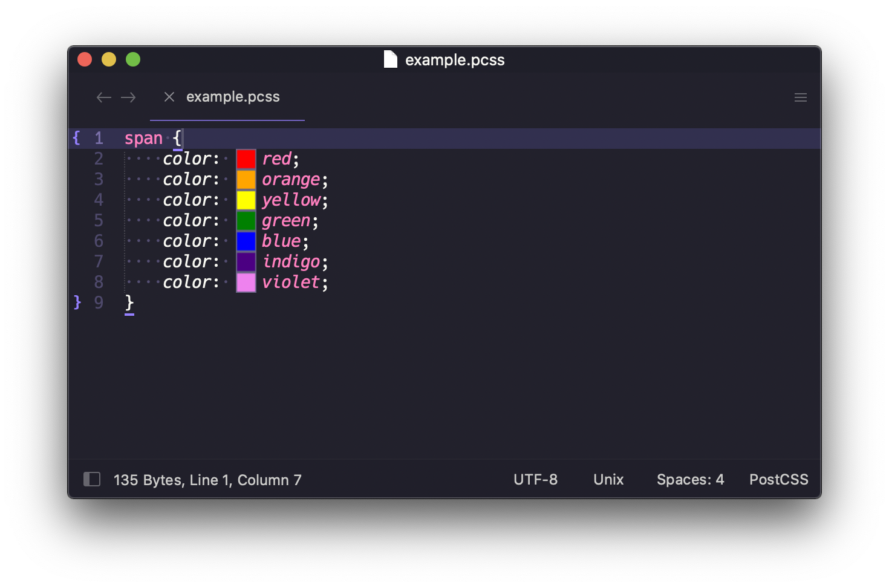

[![Donate via PayPal][donate-image]][donate-link]
[![Discord][discord-image]][discord-link]
[![Build][github-ci-image]][github-ci-link]
[![Package Control Downloads][pc-image]][pc-link]
![License][license-image]
# ColorHelper

ColorHelper makes working with colors easier by providing inline color previews in your documents (ST3 build 3118+) and
offers popups with color previews, color conversion, and allows the storing and accessing of favorite colors in color
palettes. It even provides tools for calculating color contrast, interpolating between colors, and more.

## Features

- Inline color previews.
- Useful tooltip popups that show the previews of selected colors.
- Support colors in CSS, SCSS, SASS, HTML attributes, and more.
- Allow saving, accessing, and managing colors in named color palettes all from the tooltip.
- Select and insert colors from the color palettes via the tooltip.
- Translate an existing color form to a new form the tooltip.  Supports `rgb`, `hsl`, `hwb`, `lch`, `lab`, and more!
- Color picker, color interpolating, color contrast tool, and more!

# Documentation

https://facelessuser.github.io/ColorHelper/

# License

ColorHelper is released under the MIT license.

Copyright (c) 2015 - 2021 Isaac Muse <isaacmuse@gmail.com>

Permission is hereby granted, free of charge, to any person obtaining a copy of this software and associated
documentation files (the "Software"), to deal in the Software without restriction, including without limitation the
rights to use, copy, modify, merge, publish, distribute, sublicense, and/or sell copies of the Software, and to permit
persons to whom the Software is furnished to do so, subject to the following conditions:

The above copyright notice and this permission notice shall be included in all copies or substantial portions of the
Software.

THE SOFTWARE IS PROVIDED "AS IS", WITHOUT WARRANTY OF ANY KIND, EXPRESS OR IMPLIED, INCLUDING BUT NOT LIMITED TO THE
WARRANTIES OF MERCHANTABILITY, FITNESS FOR A PARTICULAR PURPOSE AND NONINFRINGEMENT. IN NO EVENT SHALL THE AUTHORS OR
COPYRIGHT HOLDERS BE LIABLE FOR ANY CLAIM, DAMAGES OR OTHER LIABILITY, WHETHER IN AN ACTION OF CONTRACT, TORT OR
OTHERWISE, ARISING FROM, OUT OF OR IN CONNECTION WITH THE SOFTWARE OR THE USE OR OTHER DEALINGS IN THE SOFTWARE

[github-ci-image]: https://github.com/facelessuser/ColorHelper/workflows/build/badge.svg?branch=master&event=push
[github-ci-link]: https://github.com/facelessuser/ColorHelper/actions?query=workflow%3Abuild+branch%3Amaster
[discord-image]: https://img.shields.io/discord/678289859768745989?logo=discord&logoColor=aaaaaa&color=mediumpurple&labelColor=333333
[discord-link]: https://discord.gg/TWs8Tgr
[pc-image]: https://img.shields.io/packagecontrol/dt/ColorHelper.svg?labelColor=333333&logo=sublime%20text
[pc-link]: https://packagecontrol.io/packages/ColorHelper
[license-image]: https://img.shields.io/badge/license-MIT-blue.svg?labelColor=333333
[donate-image]: https://img.shields.io/badge/Donate-PayPal-3fabd1?logo=paypal
[donate-link]: https://www.paypal.me/facelessuser
