# User Guide

## Overview

ColorHelper is a tool for generating color previews and useful tools and tooltips. It also provides a couple of useful
tools. ColorHelper provides support for a number of color spaces: sRGB, HSL, HWB, LCH, LAB, and more.

!!! note "Note"
    Popups are provided by the [`mdpopups`][mdpopups] dependency.

## Color Previews

When color previews are enabled, when ColorHelper detects a color in the visible viewport, it will create a preview
right next to it. When if the image is clicked, a tooltip will appear which gives access to tools and other features.

If desired, previews can be configured to only show when a color is selected.

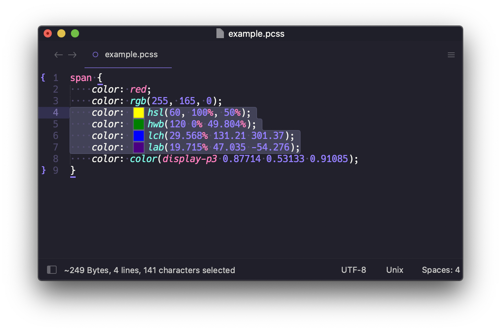

Colors that are out of preview gamut space (sRGB) will be gamut mapped. If on ST4, on hover, the color will mention that
it was out of gamut.

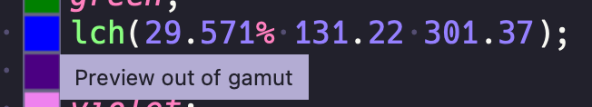

If gamut mapping is disabled, the color will be displayed in such a way as to indicate that it is out of gamut.

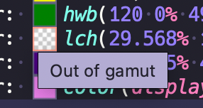

## Color Info

The Color Info Panel is the main panel. It shows a large color preview and gives access to various tools, such as
conversions, access to a color picker, etc. You can "mark" colors and add them to your favorites, or save them away
in other [palettes](#palette-panel) than can be accessed later.

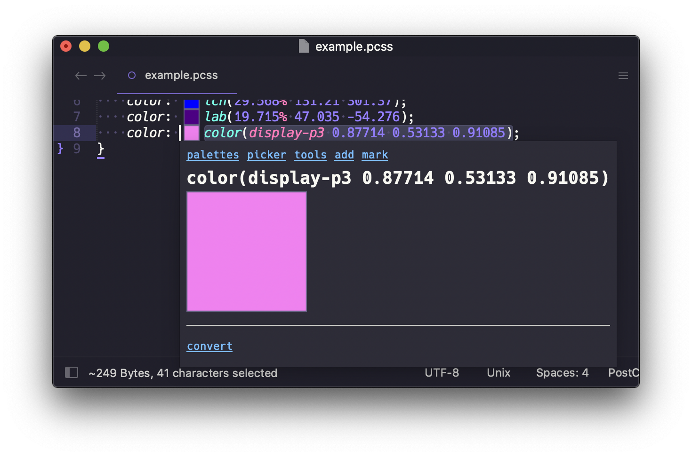

## Color Picker

The internal color picker can be launched from the view's context menu, the command palette, or from the
[Color Info Panel](#color_info).  When launched it will use the current selected color. The internal color picker is
contained inside a tooltip.  It has a color map section at the top where different colors can be selected. You can
toggle between altering the color in the sRGB, HSL, or HWB color space.

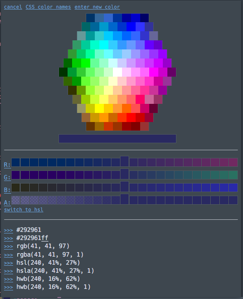

The color channels are coarse, but can generally allow you to get close to a color that you like.  As you select colors
in the channel the selections will shift revealing more selections until the bounds of the color channel are reached. If
you need finer selections, you can click the label to the left and a scrollable tooltip with much finer selections will
appear so that you can select the best suited value.

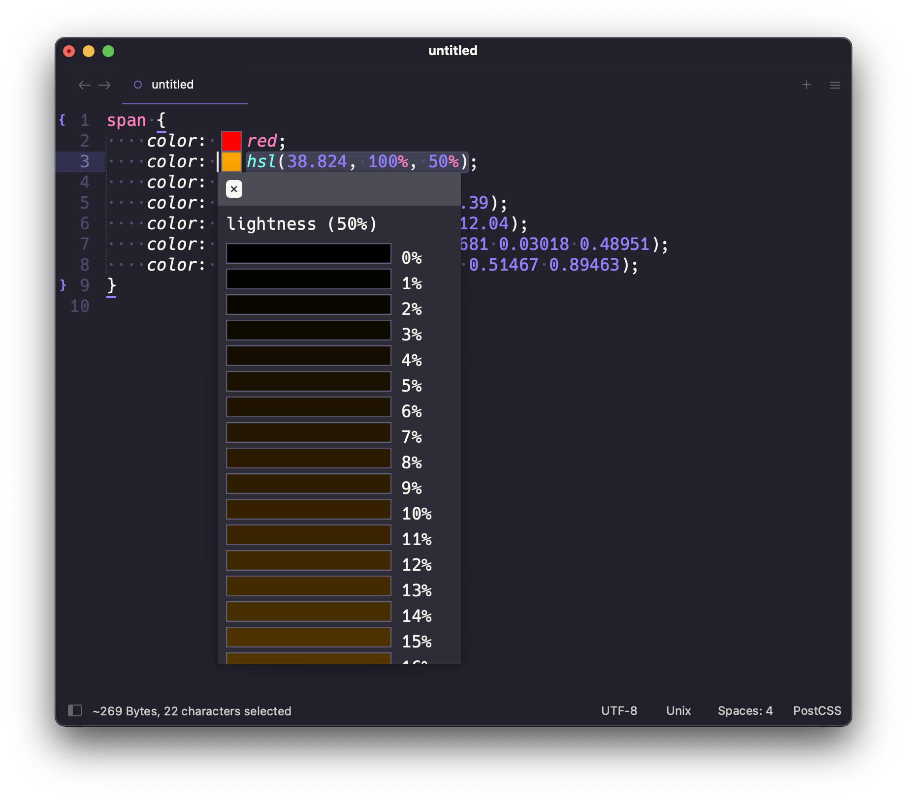

If you would like to pick from a list of CSS color names, you can select the `color names` link and a CSS Color Names
panel will open:

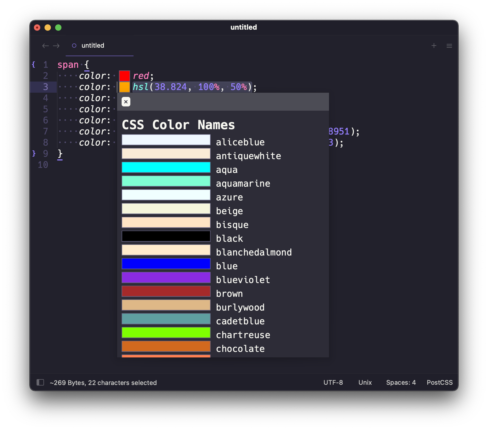

When done, simply select the `select` link to insert the color back into the document.

## Edit Tool

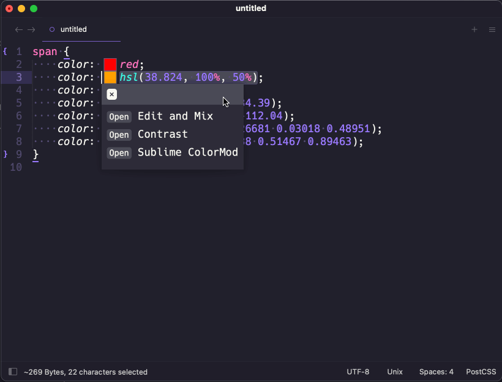

The edit tool allows for editing of colors and mix with other colors. While editing, the panel will display a live
preview. The tool will mix colors in the color space of the first color unless one is specified.

If percents are defined, they must add up to 100%, if they do not, they will be scaled. If only a single percent is
defined, the other color will use 1 - percent.

The tool can be launched from the quick panel (if a color is selected), from the info panel, or even the color picker.
When editing is complete, simply press enter and the color will be handed returned to the document for inserting, or
to the color picker if launched from there.

## Color Contrast Tool

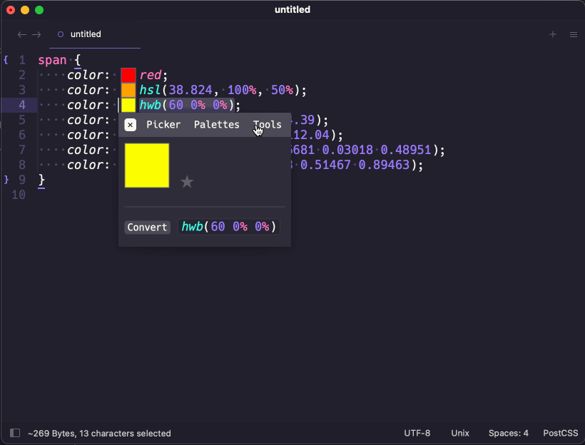

The contrast tool allows for viewing a color's contrast ratio or quickly adjusting a color to meet a minimum contrast
ratio (if the ratio is achievable).

When the color is updated, a visual representation of the foreground and background color will be rendered along with
information detailing the relative luminance of the colors and the contrast ratio.

If a a ratio is specified, the foreground color will be adjusted in an attempt to meet that requirement.

The tool can be launched from the quick panel (if a color is selected), from the info panel, or even the color picker.
When editing is complete, simply press enter and the color will be handed returned to the document for inserting, or
to the color picker if launched from there.

## Sublime ColorMod Tool

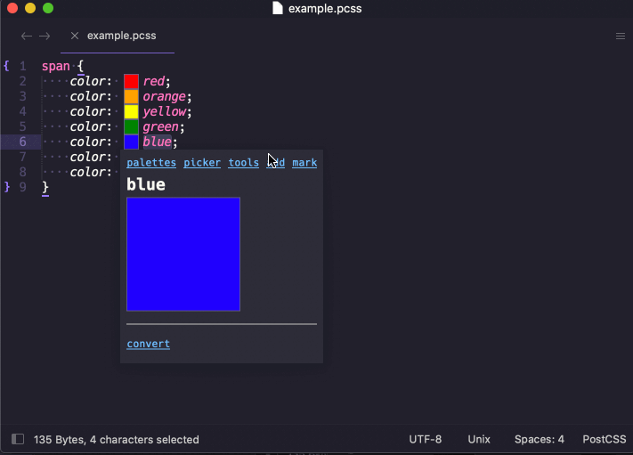

The Sublime ColorMod tool allows for entering in Sublime `color-mod` syntax and should render a color fairly close to
what Sublime does. This can be useful in theme or color scheme development.

The tool can be launched from the quick panel (if a color is selected), from the info panel, or even the color picker.
When editing is complete, simply press enter and the color will be handed returned to the document for inserting, or
to the color picker if launched from there.

## Color Palettes

ColorHelper allows for saving colors in color palettes. These are either saved globally or in project settings. 

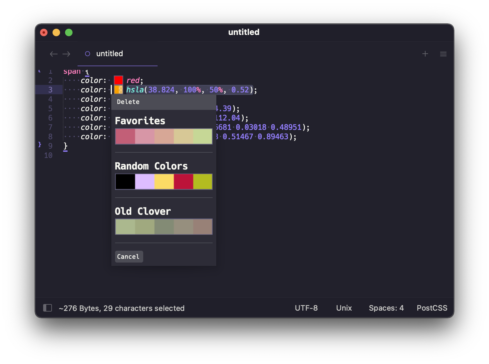

When clicking a palette, all the colors within it will be displayed.

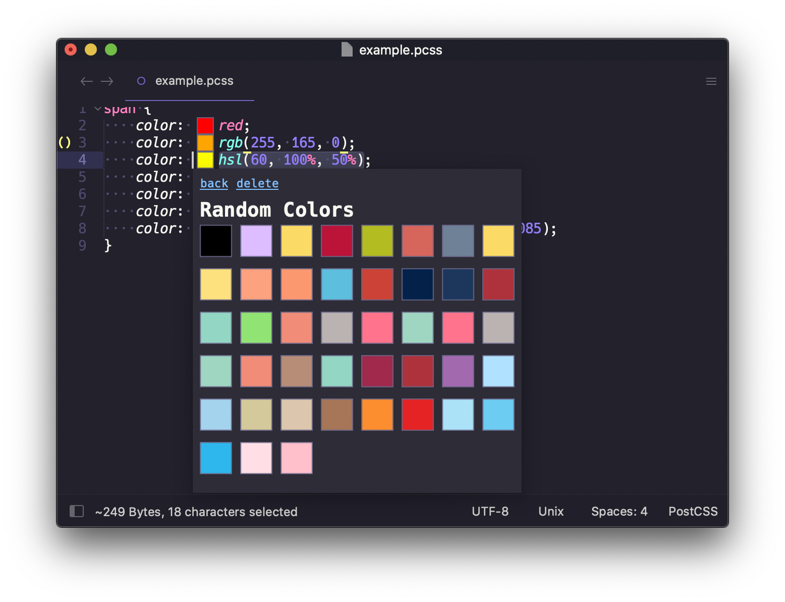

Colors can also be quickly saved away or removed from the global "Favorites" palette by selecting `mark` or `unmark`
from the main panel.

Creation and deletion of palettes and colors can be managed directly from the ColorHelper tooltip panels.

--8<-- "refs.md"
