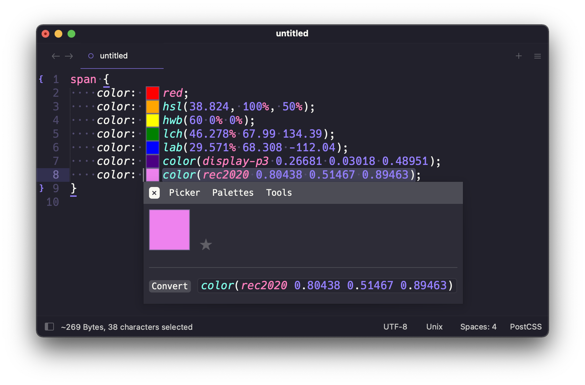
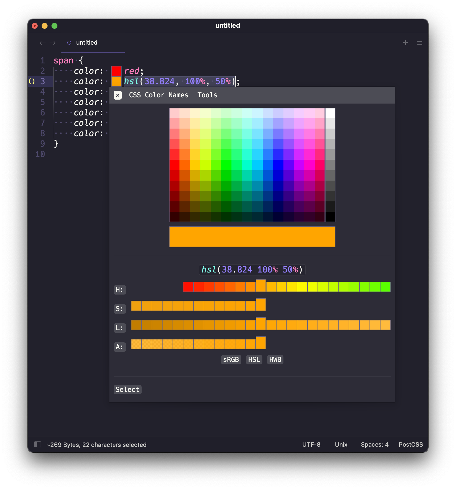
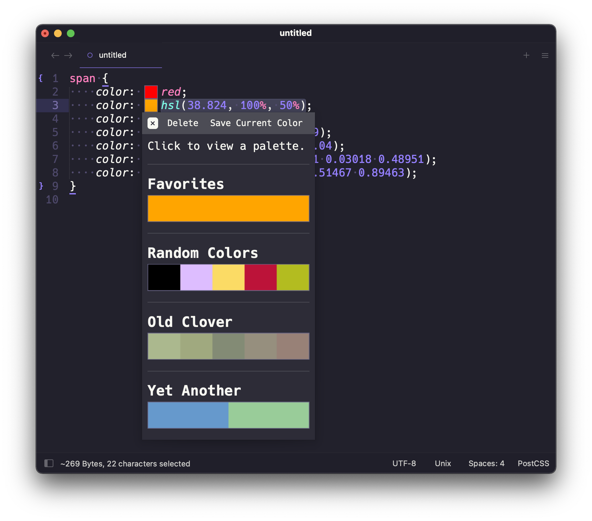
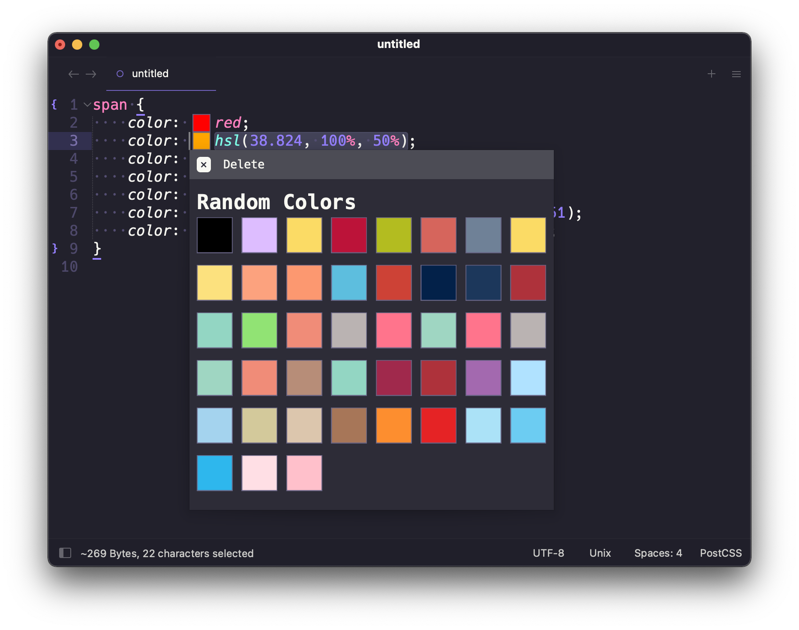

# User Guide

## Overview

ColorHelper is a plugin for generating color previews. It also provides a couple of useful tools. ColorHelper provides
support for a number of color spaces: sRGB, HSL, HWB, LCH, LAB, and more.

!!! note "Note"
    Popups are provided by the [`mdpopups`][mdpopups] dependency.

## Color Previews

When color previews are enabled, ColorHelper detects colors in the visible viewport, it will create a previews right
next to every color it finds. When the preview is clicked, a tooltip will appear which gives access to tools and other
features.

If desired, previews can be configured to only show when a color is selected.

Colors that are out of the preview gamut space (sRGB) will be gamut mapped. If on ST4, hovering over the color previews
will show a tooltip mentioning that the color is out of gamut. This is to remind the user that the color they see has
been "fit" to the preview color space (sRGB).

If gamut mapping is disabled, the color will be displayed in such a way as to indicate that it is out of gamut.

## Color Info

The Color Info Panel is the main panel. It shows a large color preview and gives access to various tools, such as
conversions, access to a color picker, etc. You can :star: colors and add them to your favorites, or save them away
in other [palettes](#palette-panel) than can be accessed later.

## Color Picker

!!! tip "Native Color Picker?"
    Some people prefer native color pickers, if you'd like to use your operating system's built-in color picker,
    see the [`use_os_color_picker`](settings/color_picker.md#use_os_color_picker) option.

The internal color picker can be launched from the view's context menu, the command palette, or from the
[Color Info Panel](#color_info).  When launched it will use the current selected color. The internal color picker is
contained inside a tooltip.  It has a color map section at the top where different colors can be selected. You can
toggle between altering the color in the sRGB, HSL, or HWB color space.

The color channels are coarse, but can generally allow you to get close to a color that you like.  As you select colors
in the channels the selections will shift revealing more selections until the bounds of the color channel are reached.
If you need finer selections, you can click the button to the left and a scrollable tooltip with much finer selections
will appear so that you can select the best suited value.

If you would like to pick from a list of CSS color names, you can select the `color names` link and a CSS Color Names
panel will open:

When done, simply select the `select` link to insert the color back into the document.

## Edit Tool

!!! warning "Experimental Color Interpolation"
    This is an experimental feature, and syntax and behavior is subject to change.

    The current logic for interpolating is based on the [CSS Level 5 Specification][css-5], particularly the recent
    drafts. While the syntax does not follow the specification, the basic logic does.

    The only logical issue is that if a percentage is applied to both colors, and the sum of those percentages add up to
    zero, it is unclear what to do as this behavior is currently undefined in the specification and will causes a divide
    by zero in the percent normalization algorithm. If this case occurs, we currently perform no interpolation and
    return nothing for this case. In all honestly, it should be rare for someone to try do this as it can only be
    achieved by either setting both percentages to zero, or to use two opposing percentages, such as 50% and -50%.
    Neither of these cases are practical.

The edit tool allows for the editing and mixing (by interpolation) of colors. While editing, the panel will display a
live preview.

When `@colorspace` is specified, the output of the color will be in the given space. Additionally, if mixing, the tool
will also interpolate colors in the provided space. If no space is specified, the color space of the first color is
used for any interpolations and will be the output color space.

The default mixing percentage is 50%, but percents can manually be added to a color to specify a percentage other than
the default. If a percentage is only specified on one color, the other color is assumed to be interpolated at `100 - p`,
where `p` is the specified percent.

If percentages are specified on both colors, they must must add up to 100%, and if they do not, they will be normalized.

The tool can be launched from the quick panel (if a color is selected), from the info panel, or even the color picker.
When editing is complete, simply press enter and the color will be returned to the document for inserting, or to the
color picker if launched from there.

## Color Contrast Tool

The contrast tool allows for viewing a color's contrast ratio or quickly adjusting a color to meet a minimum contrast
ratio (if the ratio is achievable).

When the color is updated, a visual representation of the foreground and background color will be rendered along with
information detailing the relative luminance of the colors and the contrast ratio.

If a a ratio is specified, the foreground color will be adjusted in an attempt to meet that requirement.

The tool can be launched from the quick panel (if a color is selected), from the info panel, or even the color picker.
When editing is complete, simply press enter and the color will be handed returned to the document for inserting, or
to the color picker if launched from there.

## Sublime ColorMod Tool

The Sublime ColorMod tool allows for entering in Sublime `color-mod` syntax and should render a color fairly close to
what Sublime does. This can be useful in theme or color scheme development.

The tool can be launched from the quick panel (if a color is selected), from the info panel, or even the color picker.
When editing is complete, simply press enter and the color will be handed returned to the document for inserting, or
to the color picker if launched from there.

## Color Palettes

ColorHelper allows for saving colors in color palettes. These are either saved globally or in project specific settings.

When clicking a palette, all the colors within it will be displayed.

You can add the current color to any palette you choose, or insert a color from one of your palettes into the active
file.

While you can manually save or delete colors from "Favorites", colors can also be quickly saved away or removed from the
global "Favorites" palette by staring or un-staring a color from the main panel.

Creation and deletion of palettes and colors can be managed directly from the ColorHelper tooltip panels.

--8<-- "refs.md"
